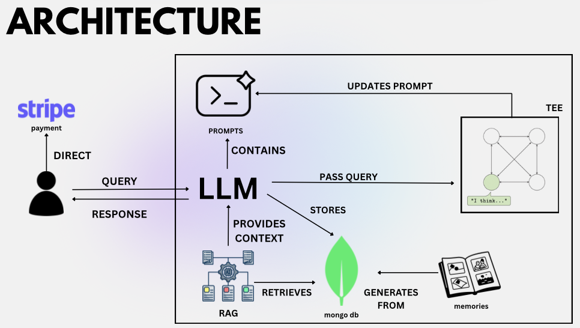

# PsyCatrist Time

## Project Description
Many individuals experiencing emotional or mental-health challenges hesitate to seek support due to social stigma. Meanwhile, expressing vulnerability seems to be a sign of weakness, leading them to hide their struggles rather than reach out for help. Many people stay silent because they are afraid of being judged. So, they avoid traditional counselling even when they need support. As a result, individuals across different ages and life stages often manage their emotional burdens in silence. Our solution provides a safe and private space for mental-health support. Hence, we use advanced AI models to understand users' emotions. The platform delivers guidance that is personalized to each individual. Users of all ages can freely express themselves and reflect on their feelings. They receive meaningful support without fear of judgment or exposure. This approach bridges the gap between silent struggles and compassionate care.

## Inspiration: How We Came Up With This Idea 💡

One of our team members, who is Asian, experienced personal mental health challenges but found that when they finally sought professional help, both family and friends labeled them as "weird." Moreover, he realized that in their culture and in many parts of Asia—there's a strong tendency to disregard the need for strict confidentiality. Often, people end up sharing their struggles openly because trusted, discreet care simply isn't accessible or valued.

We thought:

"What if everyone could access mental health support that stays completely confidential, so they can get help without being judged by family and friends?"
This exploration led us to design a platform that is not only accessible and adaptive but also offers rock-solid confidentiality. Our research and real-life stories revealed that:

Limited Mental Health Infrastructure: In many Asian countries, a shortage of professionals and inadequate funding mean that reliable mental health care is scarce.
Cultural and Social Barriers: Deep-rooted cultural stigma—such as the need to "save face" and maintain family honor—often deters individuals from seeking help. Traditional beliefs and a preference for informal support further compound the problem.
Economic and Systemic Challenges: In regions with underfunded health services and uneven access between urban and rural areas, even those who want help may not be able to receive it in a timely, confidential manner.
Understanding these challenges, we were inspired to create a mental healthcare assistant that preserves the user's privacy while delivering personalized, effective support tailored to the unique cultural context of many Asian communities.


## The Problem🚧

In many Asian societies, cultural stigmas associated with mental health often discourage individuals from seeking professional psychiatric help. The perception that visiting a psychiatrist is unusual or "weird" can lead to profound social pressure, causing people to avoid in-person consultations even when they may be struggling with mental health issues. In addition, there is a deep-seated concern about confidentiality as users fear that their private issues may not remain secure in traditional treatment settings. This combination of social stigma and privacy fears creates a significant barrier, leading to unmet mental health needs within these communities.

## Key Features
- AI-powered chat support for emotional guidance
- Private and judgment-free environment
- Google authentication for secure access
- Chat session history and summaries
- Memory generation and reflection panels
- Interactive manga/comic generation
- 3D interactive elements for engaging user experience

## Tech Stack
- **Frontend:** Next.js 16, React 19, TypeScript
- **Database:** MongoDB
- **AI:** OpenAI API
- **Authentication:** Google OAuth
- **Styling:** Tailwind CSS
- **3D Graphics:** Three.js, React Three Fiber, Spline
- **Media Storage:** Cloudinary
- **State Management:** Jotai

## System Architecture



Our system is built around an LLM-centric architecture that provides secure, private mental health support:

- **User Interface**: Users interact directly with the LLM through queries and receive personalized responses
- **LLM Core**: The central component that processes queries, manages prompts, and coordinates system operations
- **TEE (Trusted Execution Environment)**: Ensures secure processing and prompt updates
- **RAG (Retrieval Augmented Generation)**: Provides contextual information by retrieving relevant data from MongoDB
- **MongoDB**: Stores user data, chat sessions, and memories for personalized experiences
- **Memories System**: Generates persistent user context and reflection panels
- **Stripe Integration**: Handles payment processing directly with users

## How to Deploy

### Prerequisites
- Node.js (v20 or higher)
- MongoDB database
- Google OAuth credentials
- OpenAI API key
- Cloudinary account

### Installation
```bash
cd frontend
npm install
```

### Environment Variables
Create a `.env.local` file in the `frontend` directory with:
```
MONGODB_URI=your_mongodb_connection_string
GOOGLE_CLIENT_ID=your_google_client_id
GOOGLE_CLIENT_SECRET=your_google_client_secret
OPENAI_API_KEY=your_openai_api_key
CLOUDINARY_CLOUD_NAME=your_cloudinary_cloud_name
CLOUDINARY_API_KEY=your_cloudinary_api_key
CLOUDINARY_API_SECRET=your_cloudinary_api_secret
```

### Development
```bash
npm run dev
```
Open [http://localhost:3000](http://localhost:3000) in your browser.

### Production
```bash
npm run build
npm start
```

## Team
- Tan Zhi Wei 
- Edwina Hon
- Angel Phoon

